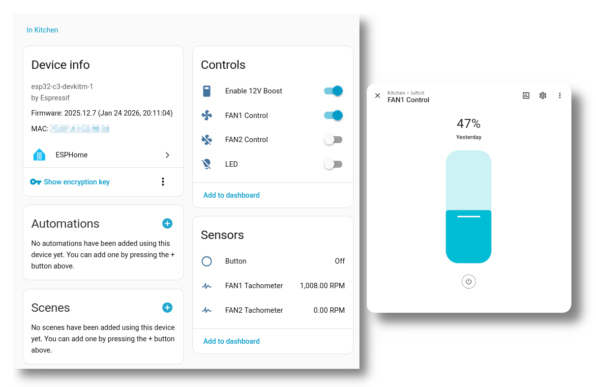

# luftctl

Small ESP32-C3 controller board to power two 12V PWM fans from a single USB-C plug.


## hardware

Schematic and PCB design can be found in [`hardware/`](hardware/). It is a KiCAD 6 project.

The schematic is available as [a PDF](schematic.pdf).

For hand-soldering, you can use the [interactive BOM viewer](hardware/ibom.html).

## firmware

### micropython

The first simple test just loops through {`5V/off`, `5V/on`, `12V/off`, `12V/on`} with every button press.

Download MicroPython from [micropython.org/download/esp32c3-usb/](https://micropython.org/download/esp32c3-usb/) and flash it with:

```
esptool.py --chip esp32c3 --port /dev/ttyACM0 erase_flash
esptool.py --chip esp32c3 --port /dev/ttyACM0 --baud 460800 write_flash -z 0x0 esp32c3-*.bin
```

Then install a virtualenv with `adafruit-ampy` and upload the [`main.py`](main.py):

```
ampy -p /dev/ttyACM0 put main.py
ampy -p /dev/ttyACM0 reset --hard
```

The red LED will blink upon every state change.

### esphome

Since the ESP32-C3 is easily supported by ESPHome, you can also add it in your HomeAssistant automation using the [provided example YAML](esphome/luftctl.yaml).



## images


